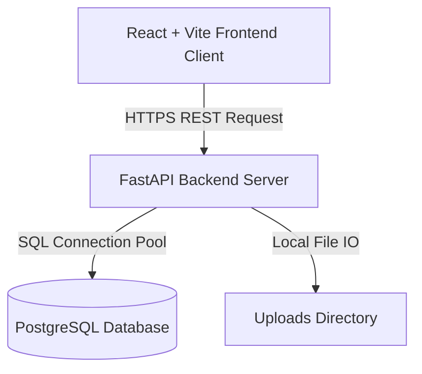

# P2P ERP Architecture Overview

This document presents the optimized production architecture, folder layouts, and performance-tuning configurations implemented for the P2P ERP system.

---

## 1. System Architecture

The P2P ERP platform utilizes a modular, multi-tier full-stack architecture built for high performance, stability, and fast data processing:



### Components
1. **Frontend**: React client bundled with Vite. Features dynamic client routing, robust global error boundaries, and centralized axios interceptors that translate failed requests into user-friendly toast notifications.
2. **Backend**: High-performance FastAPI server. Features structured logger setups, global middleware exception-handling blocks, and asynchronous route optimizations.
3. **Database**: PostgreSQL engine configured with native connection pooling, executing transaction checks prior to pool recycling (`pre-ping`), resolving SQLite database-locking freezes.

---

## 2. Optimized Folder Directory Layout

```
P2P_ERP/
├── backend/                  # FastAPI Application Core
│   ├── main.py               # Server entry point, dynamic CORS, global error handling
│   ├── database.py           # DB session setup, pool configs, lazy loading
│   ├── models.py             # SQLAlchemy Database Schema
│   ├── schemas.py            # Pydantic Schemas for verification
│   ├── auth_router.py        # Authentication & Role verification
│   └── *_router.py           # Feature-specific API Routers (PO, SO, Inventory, etc.)
│
├── frontend/                 # React Frontend Client
│   ├── src/
│   │   ├── components/       # Custom reusable components
│   │   │   ├── ErrorBoundary.tsx  # Prevents WSOD (White Screen of Death) on runtime crashes
│   │   │   └── AddItemModal.tsx   # Catalog management overlays
│   │   │
│   │   ├── pages/            # View Pages (Analytics, List Views, Details, Forms)
│   │   │   └── AnalyticsDashboard.tsx  # High-performance charts & KPIs
│   │   │
│   │   ├── api.ts            # Centralized API layer, global Toast handling interceptor
│   │   ├── App.tsx           # Route setup and component wrappers
│   │   └── index.css         # Styling directives
│   │
│   ├── vite.config.ts        # Vite configuration & dev proxy
│   └── package.json          # Node dependencies
│
├── Dockerfile.backend        # Backend production environment setup
├── Dockerfile.frontend       # Frontend production environment setup
├── docker-compose.yml        # Orchestration configurations
├── ecosystem.config.cjs      # PM2 process manager options
├── .env                      # Centralized configuration variables
└── README.md
```

---

## 3. High-Performance ERP Tuning

1. **SQL Connection Pooling**:
   Configured with a robust size of `pool_size=20` and `max_overflow=0` inside `database.py` to prevent thread leaks and connection exhaustion during peak transaction volumes (e.g. concurrent Purchase Order creation).
2. **Dynamic UI Rendering**:
   Table loads are dynamic and optimized. Request interceptors handle server connectivity checks so users get immediate notifications if an endpoint degrades, instead of silently failing.
3. **Vite Development Proxy**:
   Proxying is handled at the dev server level so developers can code on `localhost:5173` without encountering CORS blocks, while serving production from a unified backend or single Nginx configuration.
